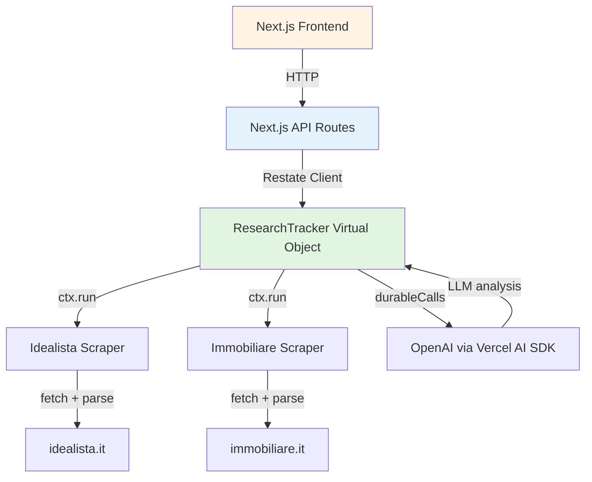

# Design Document

## Overview

The real estate tracker is implemented as a Next.js 15 application with a Restate Virtual Object backend. The system uses Restate's durable execution for reliable property scraping and state management, Vercel AI SDK for intelligent content extraction, and a simple React-based frontend for user interaction.

Architecture follows a three-tier pattern:
1. **Frontend (Next.js React)**: Simple UI for research management, ad viewing, and AI questions
2. **API Layer (Next.js API Routes)**: REST endpoints that interface between UI and Restate
3. **Backend (Restate Virtual Objects)**: Stateful research objects managing ads and questions with durable AI-powered scraping

## Steering Document Alignment

### Technical Standards (tech.md)

No tech.md exists yet, so we establish patterns:
- Use Restate Virtual Objects for stateful workflow management
- Integrate Vercel AI SDK with `@restatedev/vercel-ai-middleware` for durable LLM calls
- Follow existing service definition patterns in `/restate/services/`
- Use Zod for schema validation and type safety
- Implement web scraping with cheerio + turndown (existing pattern)

### Project Structure (structure.md)

No structure.md exists yet. We follow the existing conventions:
- Restate services in `/restate/services/`
- Scraping utilities in `/restate/services/utils/`
- Next.js API routes in `/app/api/`
- Frontend pages in `/app/`
- Type definitions co-located with implementation or in dedicated types files
- Path alias `@/` for absolute imports

## Code Reuse Analysis

### Existing Components to Leverage

- **`@restatedev/vercel-ai-middleware` (durableCalls)**: Will wrap language models to journal AI responses for deterministic replay
- **Web scraping pattern from `agent.ts`**: The existing `readWebPage` tool demonstrates using cheerio + turndown to extract clean content from HTML
- **`ctx.run()` pattern**: Existing services show wrapping non-deterministic operations (API calls) in `ctx.run()` for durability
- **Zod schemas**: Existing AI tool definitions use Zod for input validation - we'll extend this to data models
- **Error handling with `TerminalError`**: Existing weather utility shows proper use of TerminalError for permanent failures

### Integration Points

- **Restate Endpoint (`/restate/endpoint.ts`)**: Will register the new ResearchTracker Virtual Object alongside existing services
- **Next.js API Route (`/app/restate/v1/[[...services]]/route.ts`)**: Already configured to serve Restate endpoint - no changes needed
- **OpenAI Integration**: Existing openai client initialization can be reused for AI-powered analysis
- **Vercel AI SDK Tools**: Follow existing tool definition pattern with `tool()` function and Zod schemas

## Architecture

The system implements a stateful Virtual Object pattern where each research project is an independent object keyed by research name. Property scraping is handled through durable AI tool calls that use site-specific scraping logic.

### Modular Design Principles

- **Single File Responsibility**:
  - One Virtual Object definition (`research-tracker.ts`)
  - Separate scraping utilities per website (`idealista-scraper.ts`, `immobiliare-scraper.ts`)
  - Individual API routes per concern (`/api/research/`, `/api/ads/`, `/api/questions/`)
  - Dedicated type definitions file (`types.ts`)

- **Component Isolation**:
  - Scraping logic isolated from Virtual Object state management
  - AI tools defined separately from main service logic
  - Frontend components separated by page/feature

- **Service Layer Separation**:
  - Restate Virtual Object handles state and orchestration
  - Scraping utilities handle HTTP and parsing
  - API routes handle HTTP contracts and validation
  - Frontend handles presentation only

- **Utility Modularity**:
  - Site-specific scrapers are independent modules
  - Shared scraping utilities (HTML cleaning, URL validation) in common module



## Components and Interfaces

### ResearchTracker Virtual Object (`/restate/services/research-tracker.ts`)

- **Purpose:** Manages all state for a research project including criteria, ads, and questions
- **Interfaces:**
  - `createResearch(ctx, criteria: string): void` - Initialize new research with criteria
  - `getCriteria(ctx): string` - Retrieve research criteria
  - `addAd(ctx, url: string): PropertyAd` - Scrape and add property listing
  - `getAds(ctx): PropertyAd[]` - Retrieve all ads
  - `updateAdStatus(ctx, adId: string, status: AdStatus): void` - Change ad status
  - `updateAdNotes(ctx, adId: string, notes: string): void` - Update manual notes for ad
  - `askQuestion(ctx, question: string): string` - AI analysis of properties (includes notes in context)
  - `getQuestions(ctx): QuestionAnswer[]` - Retrieve Q&A history
- **Dependencies:**
  - Idealista scraper utility
  - Immobiliare scraper utility
  - OpenAI client (via Vercel AI SDK)
  - `@restatedev/vercel-ai-middleware`
- **Reuses:**
  - `ctx.run()` pattern from existing agent service
  - Vercel AI SDK integration pattern
  - State management with `ctx.get()` and `ctx.set()`

### Idealista Scraper Utility (`/restate/services/utils/idealista-scraper.ts`)

- **Purpose:** Extract property details from idealista.it listings
- **Interfaces:**
  - `scrapeIdealistaAd(url: string): Promise<PropertyAd>` - Scrape and parse listing
- **Dependencies:**
  - cheerio (HTML parsing)
  - turndown (HTML to Markdown)
  - Zod (validation)
- **Reuses:**
  - Web scraping pattern from existing `readWebPage` tool
  - HTML cleaning logic (remove nav, ads, scripts)

### Immobiliare Scraper Utility (`/restate/services/utils/immobiliare-scraper.ts`)

- **Purpose:** Extract property details from immobiliare.it listings
- **Interfaces:**
  - `scrapeImmobiliareAd(url: string): Promise<PropertyAd>` - Scrape and parse listing
- **Dependencies:**
  - cheerio (HTML parsing)
  - turndown (HTML to Markdown)
  - Zod (validation)
- **Reuses:**
  - Web scraping pattern from existing `readWebPage` tool
  - HTML cleaning logic (remove nav, ads, scripts)

### Research API Routes (`/app/api/research/`)

- **Purpose:** HTTP interface for research CRUD operations
- **Interfaces:**
  - `POST /api/research` - Create research with name and criteria
  - `GET /api/research/:name` - Get research details
- **Dependencies:**
  - `@restatedev/restate-sdk-clients` for Restate ingress client
- **Reuses:**
  - None (new API layer)

### Ads API Routes (`/app/api/ads/`)

- **Purpose:** HTTP interface for property ad operations
- **Interfaces:**
  - `POST /api/ads/:researchName` - Add ad by URL
  - `GET /api/ads/:researchName` - List all ads
  - `PATCH /api/ads/:researchName/:adId/status` - Update ad status
  - `PATCH /api/ads/:researchName/:adId/notes` - Update ad notes
- **Dependencies:**
  - `@restatedev/restate-sdk-clients`
- **Reuses:**
  - None (new API layer)

### Questions API Routes (`/app/api/questions/`)

- **Purpose:** HTTP interface for AI-powered Q&A
- **Interfaces:**
  - `POST /api/questions/:researchName` - Ask question
  - `GET /api/questions/:researchName` - Get Q&A history
- **Dependencies:**
  - `@restatedev/restate-sdk-clients`
- **Reuses:**
  - None (new API layer)

### Research Page (`/app/research/[name]/page.tsx`)

- **Purpose:** Main UI for viewing and managing a research project
- **Interfaces:**
  - Displays ad table with filtering/sorting
  - Provides ad status update controls
  - Provides ad notes input/display for each ad
  - Shows question/answer sidebar
- **Dependencies:**
  - Next.js 15 App Router
  - React (built-in)
  - Fetch API for calling API routes
- **Reuses:**
  - None (new frontend)

### Home Page (`/app/page.tsx`)

- **Purpose:** Landing page for creating/selecting research
- **Interfaces:**
  - Research creation form
  - List of existing research projects (optional)
- **Dependencies:**
  - Next.js 15 App Router
  - React (built-in)
- **Reuses:**
  - None (new frontend)

## Data Models

### PropertyAd

```typescript
import { z } from 'zod';

export const RenovationStatusSchema = z.enum([
  'new',
  'little renovation', // small changes, like painting, new parquet, etc
  'to renovate extensively' // needs extensive renovation, including new heating, etc
]);

export const AdStatusSchema = z.enum([
  'to reach out',
  'visit appointment taken',
  'sent the offer',
  'bought',
  'rejected'
]);

export type AdStatus = z.infer<typeof AdStatusSchema>;

export const PropertyAdSchema = z.object({
  id: z.string(), // Generated UUID
  url: z.string().url(),
  source: z.enum(['idealista', 'immobiliare']),
  title: z.string(),
  price: z.number().optional(),
  location: z.string(),
  size: z.number().optional(), // Square meters
  rooms: z.number().optional(),
  bathrooms: z.number().optional(),
  description: z.string(),
  descriptionSummary: z.string(), // Summary of the description, without real estate agents bullshits
  renovationStatus: RenovationStatusSchema,
  features: z.array(z.string()),
  status: AdStatusSchema,
  notes: z.string().optional(), // User's manual notes
  adAge: z.string(), // ~ Number of months or weeks or days
  scrapedAt: z.string(), // ISO timestamp
});

export type PropertyAd = z.infer<typeof PropertyAdSchema>;
```

### QuestionAnswer

```typescript
import { z } from 'zod';

export const QuestionAnswerSchema = z.object({
  id: z.string(), // Generated UUID
  question: z.string(),
  answer: z.string(),
  askedAt: z.string(), // ISO timestamp
});

export type QuestionAnswer = z.infer<typeof QuestionAnswerSchema>;
```

### ResearchState

```typescript
import { z } from 'zod';

export const ResearchStateSchema = z.object({
  name: z.string(), // Virtual Object key
  criteria: z.string(),
  ads: z.array(PropertyAdSchema),
  questions: z.array(QuestionAnswerSchema),
  createdAt: z.string(), // ISO timestamp
});

export type ResearchState = z.infer<typeof ResearchStateSchema>;
```

## Error Handling

### Error Scenarios

1. **Invalid URL Domain**
   - **Handling:** Validate URL domain in API route before calling Restate. Throw `TerminalError` if not idealista.it or immobiliare.it
   - **User Impact:** Immediate error message: "Only idealista.it and immobiliare.it URLs are supported"

2. **Scraping Failure (Network/Parsing)**
   - **Handling:** Let Restate retry automatically (no TerminalError). If retries exhausted, catch and return error
   - **User Impact:** "Failed to scrape property listing after multiple attempts. Please try again later."

3. **Invalid Research Name**
   - **Handling:** Validate research name in API route (alphanumeric, hyphens, max length). Return 400 error
   - **User Impact:** "Research name must contain only letters, numbers, and hyphens"

4. **Ad Not Found**
   - **Handling:** Check if adId exists in research state before updating status or notes. Throw TerminalError if not found
   - **User Impact:** "Property ad not found in this research"

5. **OpenAI API Failure**
   - **Handling:** Let Restate retry API calls automatically. If persistent failure, catch and return graceful error
   - **User Impact:** "AI analysis temporarily unavailable. Please try again shortly."

6. **Research Already Exists**
   - **Handling:** In `createResearch`, check if criteria already set. If yes, throw TerminalError
   - **User Impact:** "Research with this name already exists. Please choose a different name."

## Testing Strategy

### Unit Testing

- **Approach:** Use `@restatedev/restate-sdk-testcontainers` for testing Virtual Object handlers in isolation
- **Key Components to Test:**
  - ResearchTracker Virtual Object handlers (createResearch, addAd, updateAdStatus, updateAdNotes, askQuestion)
  - Scraper utilities (mock HTTP responses, test parsing logic)
  - URL validation logic
  - Status transition logic
  - Notes update logic
  - AI question context includes notes
  - State management operations (get/set)

**Example Test Structure:**
```typescript
import { RestateTestEnvironment } from "@restatedev/restate-sdk-testcontainers";
import { describe, it, beforeAll, afterAll, expect } from "vitest";
import { researchTracker } from "./research-tracker";

describe("ResearchTracker", () => {
  let restateTestEnv: RestateTestEnvironment;

  beforeAll(async () => {
    restateTestEnv = await RestateTestEnvironment.start({
      services: [researchTracker]
    });
  });

  afterAll(async () => {
    await restateTestEnv?.stop();
  });

  it("should create research with criteria", async () => {
    const client = restateTestEnv.ingress()
      .objectClient(researchTracker, "my-search");

    await client.createResearch("2 bed apartment in Milan under 300k");

    const state = restateTestEnv.stateOf(researchTracker, "my-search");
    const criteria = await state.get("criteria");

    expect(criteria).toBe("2 bed apartment in Milan under 300k");
  });
});
```

### Integration Testing

- **Approach:** Test full flow from API routes through Restate to scrapers using test containers
- **Key Flows to Test:**
  - Complete research creation flow: POST /api/research → Virtual Object creation → state verification
  - Ad addition flow: POST /api/ads → scraping → state storage → GET /api/ads
  - Status update flow: PATCH /api/ads/:id/status → state update → verification
  - Notes update flow: PATCH /api/ads/:id/notes → state update → verification
  - Question flow: POST /api/questions → AI call (with notes in context) → response storage → GET /api/questions
  - Error scenarios: invalid URLs, non-existent research, duplicate research names, notes on non-existent ad

**Test Environment:**
- Start RestateTestEnvironment with research tracker service
- Use test environment baseUrl for API route testing
- Mock external dependencies (idealista/immobiliare) with test fixtures

### End-to-End Testing

- **Approach:** Use Playwright or Cypress for full user journey testing in browser
- **User Scenarios to Test:**
  1. **New Research Creation:**
     - Navigate to home page
     - Fill in research name and criteria
     - Submit and verify research page loads

  2. **Add Property Listings:**
     - Open research page
     - Submit idealista.it URL
     - Verify ad appears in table
     - Submit immobiliare.it URL
     - Verify second ad appears

  3. **Status Management:**
     - Change ad status from "to reach out" to "visit appointment taken"
     - Verify status updates in UI
     - Filter by status "visit appointment taken"
     - Verify filtering works

  4. **Notes Management:**
     - Add notes to a property ad
     - Verify notes are saved and displayed
     - Update existing notes
     - Verify notes update correctly

  5. **AI Q&A with Notes:**
     - Add notes to an ad with context
     - Type question referencing the notes
     - Submit question
     - Verify answer includes context from notes
     - Verify question saved in history

  6. **Error Handling:**
     - Submit invalid URL
     - Verify error message displays
     - Try to create duplicate research
     - Verify error handling
